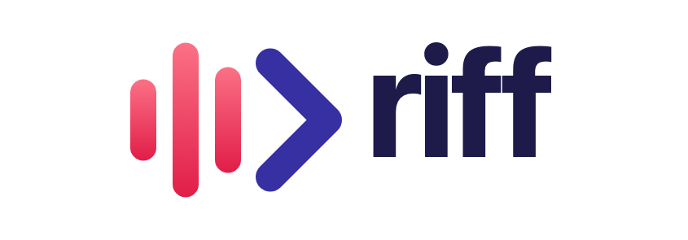

<div align="center">
    

<h3>From riff to release.</h3>

<p>A privacy-first desktop app that records your meetings, transcribes and summarizes them on your own machine, and then turns what was said into requirements, a plan, working code and a QA report.</p>
</div>

---

## Why "Riff"?

Riff is named for its maker, **Rifaz Iqbal**. It takes the "Rif" in Rifaz, and it describes what a good meeting is: people riffing on an idea until it takes shape. Most meeting tools stop at the notes. Riff keeps going and carries the idea through requirements, plan, code and QA.

## What it does

**Meetings, locally**

- **Real-time transcription** on your device with Whisper or Parakeet models. No cloud required.
- **Professional audio mixing**: captures microphone and system audio together, with RMS-based ducking and clipping prevention.
- **AI summaries** from your choice of provider: Ollama (local), Claude, Groq, OpenRouter, or any OpenAI-compatible endpoint.
- **Import & enhance**: transcribe existing audio files, or re-transcribe a recording with a different model or language.
- **GPU acceleration**: Metal/CoreML on macOS, and Vulkan or CUDA builds on Windows and Linux.

**Dev Sessions: meeting → code**

From any transcript, the **Requirements** button starts a Dev Session against one of your configured repos:

1. **Requirements agent**: turns the conversation (plus the optional AI summary) into a requirements doc you refine together.
2. **Plan agent**: writes an implementation plan.
3. **Coding agent**: implements it on a branch.
4. **QA agent**: checks the result and writes a report.

You can also start a session from a typed idea instead of a meeting. The agents run in a local server (`harness-server/`) that the app starts itself, and it only accepts requests from the app.

**Private by design**

Recordings, transcripts, models and meeting sources stay on your machine. Cloud AI providers are used only when you configure them.

## Getting started

Riff is built from source. You need Rust, Node.js 22+ and pnpm.

```bash
git clone git@github.com:Rifazi/harness.git riff
cd riff/frontend
pnpm install --frozen-lockfile
./clean_run.sh          # macOS dev run (see CLAUDE.md for Windows/GPU variants)
./build-gpu.sh          # production build with the best GPU backend for this machine
```

- [Building from source](docs/BUILDING.md)
- [Building on Linux](docs/building_in_linux.md)
- [GPU acceleration](docs/GPU_ACCELERATION.md)
- [Architecture](docs/architecture.md)

### Coming from Meetily?

Riff uses a new bundle identifier (`com.rifaz.riff`). On first launch it moves your existing Meetily data (meetings, models, settings and app storage) into Riff's folders, so nothing needs to be re-downloaded. **Quit Meetily before you first open Riff.**

## Architecture

Riff is a single Tauri 2 application: a Rust core handles audio capture, transcription, storage and summarization, and a Next.js 14 UI talks to it through Tauri commands and events. The Dev Sessions agent server is a local Node/Fastify process the app starts and stops with itself.

## Credits

Riff is built on [**Meetily**](https://github.com/Zackriya-Solutions/meeting-minutes) by Zackriya Solutions, an open-source, privacy-first meeting assistant released under the MIT License. The Dev Sessions agents come from Rifaz Iqbal's earlier "harness" project.

Meetily in turn builds on:

- [Whisper.cpp](https://github.com/ggerganov/whisper.cpp), [Screenpipe](https://github.com/mediar-ai/screenpipe) and [transcribe-rs](https://crates.io/crates/transcribe-rs)
- **NVIDIA**'s **Parakeet** model, with the [ONNX conversion](https://huggingface.co/istupakov/parakeet-tdt-0.6b-v3-onnx) by istupakov

## License

MIT. See [LICENSE](LICENSE). The original Meetily copyright notice is retained.
